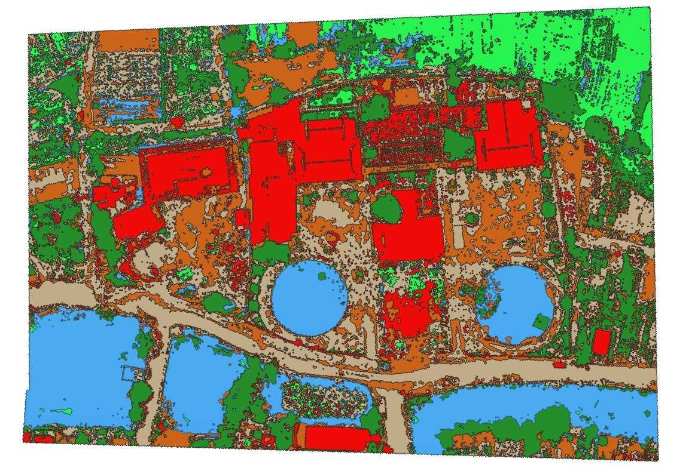

# Machine Learning-Based Image Segmentation for Drone Imagery

In this project, I utilized three machine learning models - KNN, SVM, and Random Forest—to segment different types of objects (trees, buildings, grass, water, roads) in drone-captured images. The dataset consists of images taken by drones from various regions in Vietnam. A pixel-based approach was employed to extract RGB indices, and additional features such as chromatic RGB, CLI, and NRGDI were calculated to train the models and improve segmentation accuracy.

Each image in the dataset is stored as a .tiff file, containing RGB indices, DSM (Digital Surface Model) values, and coordinate information. I utilized the RGB and DSM data to classify the objects within the images.
Each
### Sample image in dataset

# Training

Three models - SVM, KNN, and Random Forest - were trained using the prepared dataset. The SVM was trained with the default parameters from the SVC class in scikit-learn. For KNN, 3 neighbors were used as the hyper-parameter. The Random Forest model was trained with 100 estimators and a maximum depth of 5 as its hyper-parameters.

# Result

## Accuracy for each model

Random Forest model show the highest accurracy, followd by KNN and then SVC.

## Inference
Original image
 

Segmented image
 

For more detailed information about this project, please refer to the [project-report](project_report.pdf) file.